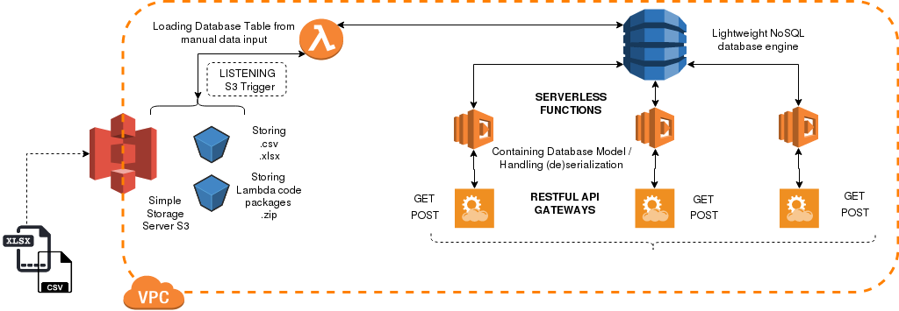

# Serverless Base Api

This project is providing the base for quickly exposing spread sheet data to a 
serverless RESTApi endpoint in AWS.

Furthermore this project is demonstrating how to integrate the AWS SAM local tool 
with PyCharm while using Pyenv and Pipenv for handling the virtual environment for
Python. It is further used in combination with Docker to run local tests on
AWS Lambda functions.

The application will be automatically deployed using AWS CloudFormation in PyCharm.



## Getting Started

The Preparation of the project takes six main steps:

1. Preparing the project environment
2. Syncing PyCharm with Pipenv and AWS tools
3. Running a local serverless test in Docker
4. Deploying the Data Load Project
5. Deploying the Api Project
6. Calling the POST endpoint

**NOTE:**

This repository is containing essentially two projects. It is best to work on them
seperately. I.e. use PyCharm to open the project on 'loaddata' and/or on
'apigateway' as the top level. Commiting changes can be done from the terminal for
both.

```
serverlessbaseapi/
├── apigateway
│   ├── apiproxyrequest_test.json
│   ├── models.py
│   ├── Pipfile
│   ├── postPermits.py
│   └── template.yaml
├── .git
├── .gitignore
├── December2016Issued.xlsx
├── loaddata
│   ├── LoadPermits.py
│   ├── models.py
│   ├── Pipfile
│   ├── s3put_test.json
│   ├── template.yaml
│   └── utils.py
└── README.md
```


## Prerequisites
 
+ Pyenv
+ Pipenv integrated with Pyenv
+ Python Version 2.7.13 installed via Pyenv
+ PyCharm Professional
+ AWS Cli
+ AWS Sam Cli
+ Docker
+ CloudFormation

## Installing
Pyenv and Pipenv is the new way to go for Python version control and virtual 
environments. Visit [SecretOfPythonPath](https://github.com/olmax99/secretofpythonpath) 
project for how to get started.

Docker should be installed on the system, else please read the [official Docker docs](https://docs.docker.com/).

### Prepare the Project's Environment
#### 1. Setting up the virtual environment and AWS tools
It is assumed that you are getting started with the project 'loaddata'. Further, 
'loaddata' should be the project name when opened in pyCharm. Once cloned from
Github, ensure that you have seperated the projects.

In project folder, verify that the correct Python version is set:

```
$ pyenv local 2.7.13
$ pyenv versions        # Verify that 2.7.13 is set
$ python --version

$ aws --version         # if not installed ensure that the aws cli tool is installed in the global pyenv Python version

# [OPTIONAL]
$ which pip                                 # confirm that you are installing into global version
$ pip install --upgrade --user awscli

```

Set the Virtual Environment Location for pipenv inside project:

```
$ set | grep PIPENV                         # verify that project directory virtualenv is not set
$ export PIPENV_VENV_IN_PROJECT="enabled"   # will create the virtualenv inside the project directory
                                                    
$ pipenv install

# [OPTIONAL]
$ unset PIPENV_VENV_IN_PROJECT              # will reverse the location to default again
                                                    
$ pipenv lock -r > requirements.txt         # will create a requirements.txt file

```

```
$ pipenv install --dev aws-sam-cli          # !!! INSTALL SAM-CLI INTO DEV OTHERWISE LOCAL LAMBDA BUILD MAY FAIL !!!
(loaddata)$ pipenv shell
(loaddata)$ sam --version
(loaddata)$ pipenv graph --json             # also verify in pyCharm > Settings > Project interpreter

```

Verify that all packages needed are installed before creating the requirements.txt
file:

```
(loaddata)$ pipenv install pyexcel
(loaddata)$ pipenv install pyexcel-xls
(loaddata)$ pipenv install pynamodb
(loaddata)$ pipenv install boto3

```

NOTE: Sam should not be available outside the virtual environment.

#### 2. Sync PyCharm with the virtual environment and AWS tools

You can skip this step if you don't intend to use the PyCharm Plugin. It is also
possible to run all further steps from the command line.

##### Using PyCharm Plugin

In pyCharm > Settings > Plugins install 'AWS Toolkit'. This may require a restart.

Ensure that the path to the sam cli executable matches with pyCharm.

```
$ which sam

```
Settings > Tools > AWS > <path/to>/venv/bin/sam
    
Ensure that the project has a flat structure:
- LoadPermits.py + requirements.txt needs to be on top

Ensure AWS:Profile within pyCharm is in the correct region !!! In this project it
will be 'eu-central-1'.

NOTE:

PyCharm has problems with recognizing the in-project located virtualenvironment
`.venv` when using a 'Pipenv' Project Interpreter . For that reason do not choose 
pipenv as a 'Project Interpreter', but rather 'Virtualenv Environment'. It is 
recommended to install all packages from the terminal using `pipenv install <package>`.

#### 3. Run a local test with the SAM tool

NOTE:

Ensure that the appropriate docker images are pulled before running a test for the
first time in pyCharm !

```
$ docker images

# [OPTIONAL]
docker run lambci/lambda:build-python3.7        # Both runs will fail, but their purpose is just to pull the
docker run lambci/lambda:python3.7              # images locally for pyCharm

```

##### Using PyCharm Plugin

In case the environment is set up correctly and in sync with PyCharm, there 
should  appear an AWS Lambda Logo next to the `def lambda_handler` function in 
LoadPermits.py

The JSON file `s3put_test.json` can be used as event input for the lambda_handler.

- 'Right-click' def lambda_handler      <-- verify that lambda symbol appears, verify Run > Edit Configurations

In PyCharm > Run > Edit Configurations... > Click the + button > AWS Lambda > local:

Configuration:
    Runtime:  python 2.7
    Handler:  LoadPermits.lambda_handler
    Environment Variables:  TableName=permits-sam-27
    Credentials: default:Default (depends on your AWS config file at ~/.aws)
    Region: Frankfurt(eu-central-1)
    Input file: s3put_test.json
    
SAM CLI:
    Skip checking for newer container images: yes
    
The Test Result should look like "load complete" along with information on the 
Billed Duration of the Lambda function.
    

**NOTE:**   Ensure that in PyCharm the correct AWS Region isselected (bottom left): 
    

HINT:   For local cloudformation template debugging: `$ sam validate --debug -t template.yaml`
        (This will automatically be done when running the local test with the SAM tool
        
For the Data Load project set Environment Variable TableName=permits-sam-27 inside 
the PyCharm run configuration for [Local] LoadPermits.lambda_handler.

For the API project set Environment Variable DYNAMOTABLE=permits-sam-27 inside the
PyCharm run configuration for [Local] postPermits.lambda_handler.

##### Using the Command Line

Validate the sam template.yaml file. In project directory (i.e. `loaddata`):

```
$ sam validate

```

Test by invoking locally

```
$ sam build    # BUILD SAM PACKAGE FIRST, OTHERWISE TEST WILL FAIL!

$ sam local invoke -e s3put_test.json LoadPermits --skip-pull-image


```

**NOTE:** `sam build` will create a lambda package, which conatins all site-packages 
along with the custom code in top folder. Its strucure will look similiar to this:


```
.aws-sam/
└── build
    ├── LoadPermits
    │   ├── boto3
    │   ├── LoadPermits.py
    │   ├── models.py
    │   ├── pyexcel
    │   ├── pynamodb
    │   ├── requirements.txt
    │   ├── template.yaml
    │   ├── urllib3
    │   ├── utils.py
    │   ├── xlrd
    └── template.yaml
    
    
```


## Deploy all AWS resources with CloudFormation

**NOTE:**   Always deploy the two projects in this order, because the Api Project 
will need the Stack name of the Data Load Project for referencing.

### 1. Data Load Project

#### Deploy using PyCharm AWS toolkit plugin

In project pane, 'Right-click' loaddata > Deploy Serverless Application. For the 
first run I recommend setting the Stack Name to 'loadpermits-sam-27' (This is just 
for referral throughout this guideline).

Create a new S3 Bucket or use an existing one. This is only for CloudFormation in
order to create the deploy package zip file.

For the Template Parameters just accept the default values for now and hit the 
Deploy button. In PyCharm you should now see how the CloudFormation pane is 
displaying all resources building up.

In your AWS UI, go to service CloudFormation > Stacks. After you got a message 
"Successfully executed change set" in PyCharm, the CloudFormation Stack with name
'loadpermits-sam-27' will appear on the AWS UI. You can find all deployed 
resources  from the template.yaml file in 

CloudFormation > Stacks > loadpermits-sam-27 > Resources.

In CloudFormation > Stacks > loadpermits-sam-27 > Outputs, you will find an 
exported Key,Value pair: LoadStackDynamoTableName, permits-27-sam. This is the 
DynamoDb table  that will be read from the Lambda function in the ApiGateway
Project.

#### Deploy from the command line

You will need to specify the following parameters:

* `--stack-name` (string): `cf-stack-loadpermits-sam-27`

* `--template-file` (string): `$PWD/packaged_permits27_template.yaml`

* `--s3-bucket` (string): `tmp-cloudformation-permits-27`

* `--parameter-overrides` (list): `BucketName=records-permits-27-sam TableName=permits-27-sam`

* [Optionally] `--tags` (list): `Name=CF-permits-27 Dataset=permits` 


```
# Make sure that the Region for this bucket aligns with where you deploy
$ aws s3 mb s3://tmp-cloudformation-permits-27 --region eu-central-1  # Example regions: us-east-1, ap-east-1, 
                                                                      # eu-central-1, sa-east-1

$ sam package --output-template packaged_permits27loaddata_template.yaml --s3-bucket tmp-cloudformation-permits-27

$ sam deploy --template-file $PWD/packaged_permits27loaddata_template.yaml \
--stack-name cf-stack-loadpermits-sam-27 \
--region eu-central-1 --capabilities CAPABILITY_IAM \
--parameter-overrides BucketName=records-permits-27-sam TableName=permits-27-sam \
--tags Name=CF-permits-27 Dataset=permits


```

#### Load data to DynamoDb

Inside your CloudFormation > Stacks > Resources > loadpermits-sam-27 > Bucket, 
open the link to the S3 Bucket. Create a new folder called '/reports'. Inside that 
folder upload the Excel file provided in the git repository. Now you follow the 
link in  CloudFormation > Stacks > Resources > DynamoTable. You should find all 
entries loaded to the database table 'permits-sam-27' > Items.

---
    
NOTE:

When deploying the loaddata application to CloudFormation it will deploy the 
resources inside the project's directory as indicated in `template.yaml`. Read the
in-line  comments for more details on the single CloudFormation resources and 
elements.


### 2. Api Gateway Project

---

IMPORTANT: The Stack name of the 'loaddata' project is an input variable for the Api Project! It is being 
passed via CloudFormation Outputs, from where it can be read in as an environment variable.

---


In your terminal, exit the virtual environment and change to the directory `serverlessbase/apigateway` 
and repeat the steps from 'Prepare the Project's Environment'.

Prepare the project's environment the same way as for the Data Load Project. Run the local test accordingly:

```
$ sam build

$ sam local invoke PostPermits -e apiproxyrequest_test.json --env-vars env.json --skip-pull-image


```


The output of the `sam local invoke` test should look similiar to this: 

```
{"body": "[]", "headers": {"Content-Type": "application/json"}, "statusCode": "200"}

```


#### Deploy using PyCharm AWS toolkit plugin

In project pane, 'Right-click' apigateway > Deploy Serverless Application. For the first run I 
recommend setting the Stack Name to 'apipermits-sam-27'.

#### Deploy from the command line

```
$ sam package --output-template packaged_permits27gateway_template.yaml --s3-bucket tmp-cloudformation-permits-27

$ sam deploy --template-file $PWD/packaged_permits27gateway_template.yaml \
--stack-name cf-stack-apipermits-sam-27 \
--region eu-central-1 --capabilities CAPABILITY_IAM \
--parameter-overrides loaddataStackName=cf-stack-loadpermits-sam-27 \
--tags Name=cf-permits-27-agw Dataset=permits


```

In your AWS Console, go to service CloudFormation > Stacks. After you got a message 
"Successfully executed change set" in PyCharm or the command line, the CloudFormation 
Stack with name `apipermits-sam-27` will appear on the AWS Console.

Inside your CloudFormation > Stacks > Resources > apipermits-sam-27 > ApiKey, open 
the link to the ApiKeys and note down the value for the Api key after you pressed 
the button 'show'.

Go back to CloudFormation > Stacks > Resources > apipermits-sam-27 > Outputs. There you 
will find the Key, Value pair: apiGatewayInvokeURL along with the respective endpoint.

You can now call the endpoint on your terminal or any preferred API tool. It should look 
similar to the following command. Note that the input parameter for the POST method is 
attached to the endpoint path. This can be any value of the datasets primary key column
with name 'application_number'.

```
curl -X POST --header "x-api-key: 33izVJrCvL3d6cEvWfFpr4YjWWH4dNVl6HVVhHgA" https://y5ussjiisj.execute-api.eu-central-1.amazonaws.com/dev/permits/201504284817

```

You should receive back the appropriate data entry for this 'application_number'. 

You successfully deployed this project. 

##### Troubleshoot
Following are some general suggestions in case of troubleshooting:

- Run > Edit Configurations > AWS Lambda > SAM cli >
        + Build function inside a container:            no
        + Skip checking for newer container images:     yes             <-- SAM WILL FAIL IF NOT SET!!!              
- requirements.txt needs to be in top
- Always create a new requirements.txt from pipenv and ensure that the required packages are present
- template.yml determines how pyCharm sam plugin is running the container
- awscli needs to be installed in global python version - it will fail if installed inside venv

        - `$ python --version`                  <-- verify that pyenv is picking up the correct version
        - `$ pip install --upgrade --user`      <-- verify that aws is running inside project dir
        


## Running the tests

Use SAM local tool in PyCharm.

## Author

**OlafMarangone** - *Initial work* - [Serverless Base Api](https://gitlab.com/olmax99/serverlessbaseapi.git)  
contact: olmax99@gmail.com

## License
 
Copyright (C) 2019 Olaf Marangone

Permission is hereby granted, free of charge, to any person obtaining a copy of this software and associated 
documentation files (the "Software"), to deal in the Software without restriction, including without limitation
the rights to use, copy, modify, merge, publish, distribute, sublicense, and/or sell copies of the Software, and to
permit persons to whom the Software is furnished to do so, subject to the following conditions:
The above copyright notice and this permission notice shall be included in all copies or substantial portions of the
Software.  
THE SOFTWARE IS PROVIDED "AS IS", WITHOUT WARRANTY OF ANY KIND, EXPRESS OR IMPLIED, INCLUDING BUT NOT LIMITED TO THE 
WARRANTIES OF MERCHANTABILITY, FITNESS FOR A PARTICULAR PURPOSE AND NONINFRINGEMENT. IN NO EVENT SHALL THE AUTHORS 
OR COPYRIGHT HOLDERS BE LIABLE FOR ANY CLAIM, DAMAGES OR OTHER LIABILITY, WHETHER IN AN ACTION OF CONTRACT, TORT OR 
OTHERWISE, ARISING FROM, OUT OF OR IN CONNECTION WITH THE SOFTWARE OR THE USE OR OTHER DEALINGS IN THE SOFTWARE.
